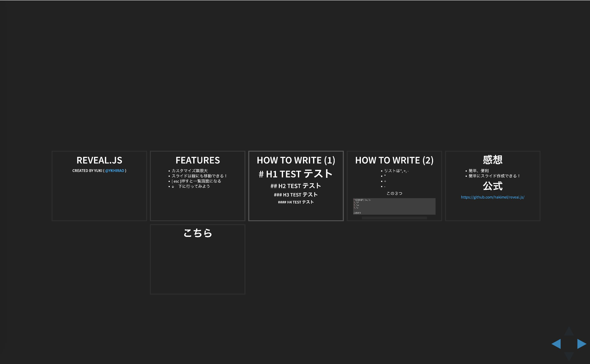

# Qiita

## 書きたいこと
GASのWEB API化  
Qiita .md 自動表生成  
ライブコーディング採用  
Slack APIレガシーの話  
Slackに大量のemoji  

## [slide_markdown](https://ykhirao.github.io/qiita/slide_markdown/)

### 内容
* Markdown記法によるスライド作成するアプリ等
* 5サンプル

### Screenshot
reveal.js

## hidden_command
ある隠しコマンドを打つとalertが出る。

## gas
Google Apps Scriptのサンプル

### Slack log
ログを取得するサンプル

### set holiday
Google Calendarの休日設定を拡張する。

.
